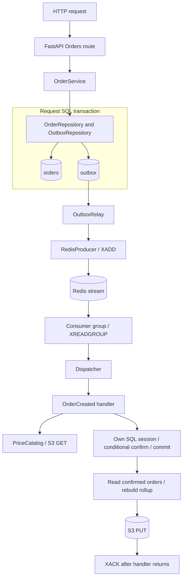
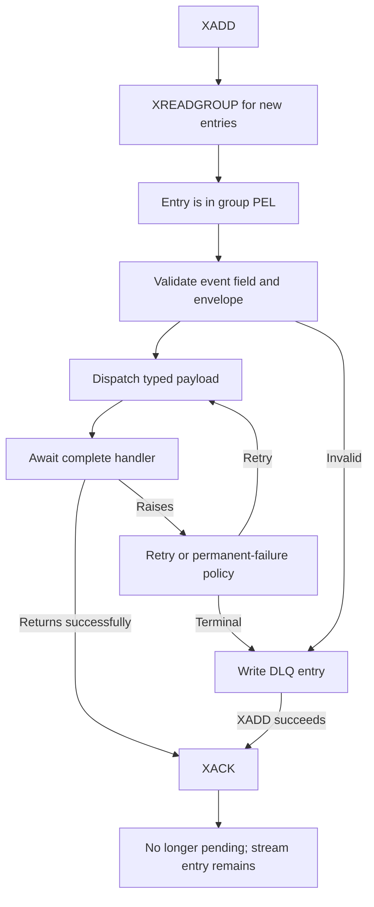
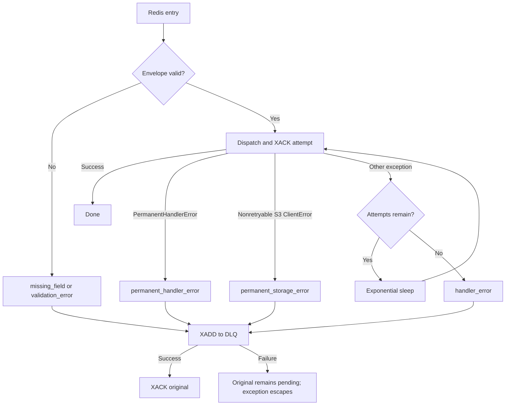
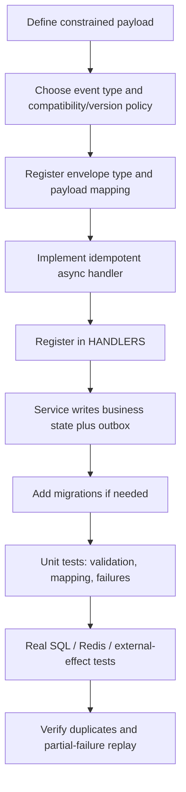

# Python Microservice Template — Implementation & Architecture Guide

## 1. Purpose and scope

This guide explains the runtime behavior, transaction boundaries, reliability
semantics, and extension points of this template. Read it before replacing the
Orders example or reviewing changes to persistence and messaging. The
[README](../README.md) remains the guide to running the project.

The implementation reviewed is repository revision `e8f50ae`. Source code takes
precedence over comments, existing documentation, and design plans. References
below link to the relevant implementation rather than reproducing entire files.
The requested `CONTRIBUTION.md` does not exist; the repository's
[CONTRIBUTING.md](../CONTRIBUTING.md) was used instead.

Labels distinguish **Implemented** behavior, **Reference implementation** domain
examples, **Limitation** of the current implementation, and **Recommendation**
for work that has not been implemented. Test coverage described here was inspected
in source; it is not a claim that the test suite was executed for this document.

The central contract is **at-least-once delivery, with idempotent handlers**.
The outbox atomically records business data and event intent in PostgreSQL. It
does not atomically commit PostgreSQL, Redis, and S3 together. A successful HTTP
response does not prove publication, handler completion, or projection freshness.

## 2. Architecture at a glance



The request path creates an order and its event in one SQL transaction. A relay
uses a **different SQL transaction** to claim and publish committed events. A
consumer receives an event independently, prices the order, commits confirmation
in its own session, and writes a daily object before acknowledging the message.

These boundaries deliberately make the HTTP write path independent of Redis and
S3 availability once the application is serving requests. They also create
observable intermediate states: an order can be pending while its event waits in
the outbox, or confirmed while its S3 rollup is still missing.

## 3. Infrastructure versus reference code

Directory names alone do not establish what should be retained. In particular,
`db/models.py` contains both a domain model and an infrastructure model, while
`core/services/` currently contains domain examples.

| Area | Normally retain | Replace or adapt for your service |
|---|---|---|
| [main.py](../main.py) | Lifespan, resource cleanup, logging/tracing wiring | App metadata, routers, role selection and optional storage wiring |
| [config/](../config/settings.py) | Cached settings, logging, request middleware, tracing setup | Defaults, service identity, domain storage keys, operational validation |
| [db/postgres/session.py](../db/postgres/session.py) | Async engine, session factory, request dependency | Pool capacity and connection policy |
| [db/models.py](../db/models.py) | `OutboxEvent` | `Order` |
| [db/repositories/](../db/repositories/outbox_repository.py) | `OutboxRepository` and caller-owned transaction convention | `OrderRepository` |
| [db/migrations/](../db/migrations/env.py) | Alembic environment and outbox schema | Orders schema and subsequent domain revisions |
| [messaging/models/](../messaging/models/envelope.py) | Envelope architecture and serialization boundary | `OrderCreatedEvent`, accepted event types and versions |
| [messaging/producer/](../messaging/producer/redis_producer.py) | Redis transport adapter | Stream topology and deployment settings |
| [messaging/outbox/](../messaging/outbox/relay.py) | Relay, SQL claim protocol, retry and retention policy | Tuning and operational supervision |
| [messaging/consumer/](../messaging/consumer/redis_consumer.py) | Consumer, validation, retry/DLQ and reclaim machinery | Handler registry entries and domain handlers |
| [storage/](../storage/object_store.py) | Optional reusable `ObjectStore` protocol, S3 adapter and fake | Whether the service needs object storage at all |
| [core/services/](../core/services/order_service.py), [api/routes/](../api/routes/orders.py) | Layering convention | Orders, pricing, daily rollup, DTOs and routes |
| [tests/](../tests/conftest.py) | Testcontainers, migrations, async isolation and reliability test patterns | Domain fixtures, assertions and catalogs |
| [docker-compose.yaml](../docker-compose.yaml) | Disposable development topology pattern | Demo credentials, SeaweedFS and catalog seeding |

**Reference implementation:** Orders, `OrderCreated`, price catalog, daily rollup,
SeaweedFS bootstrap and demo commands are examples. **Optional infrastructure:**
the generic storage interface and adapter are reusable even though the example
uses them. Removing storage requires updating startup, health, handlers, routes,
settings, tests, and the consumer's imports of storage error types. There is no
`S3_ENABLED` switch.

## 4. Bootstrap, lifecycle and async execution

[main.py](../main.py) configures logging and OpenTelemetry during import, creates
the FastAPI app, attaches middleware, and includes the health, info, Orders and
rollup routers. Import therefore reads settings, including required
`DATABASE_URL`. Database and Redis connections are otherwise resolved lazily.

The lifespan performs the following work:

1. Opens the process-wide S3 client context before handlers can use it. Opening
   the client does not establish that the bucket or price catalog exists.
2. Creates a background `RedisConsumer.start()` task unconditionally.
3. Creates an `OutboxRelay.start()` task when `RELAY_ENABLED` is true.
4. Yields control so FastAPI can serve requests.
5. On normal shutdown, signals the consumer to stop, waits up to ten seconds,
   cancels it if necessary, and closes its Redis client. It then does the same
   stop/wait sequence for the relay.
6. Clears the relay and price-catalog singleton, closes S3 and the producer, and
   disposes the database engine.

Task completion callbacks log failures. **Limitation:** they do not restart dead
tasks or change readiness. Startup does not wait for successful consumer group
creation or the first relay pass. The lifespan also lacks an encompassing
`try/finally` for partial startup failure; its normal cleanup is not a universal
resource-unwind guarantee.

**Implemented:** request I/O, SQLAlchemy/asyncpg, Redis and aioboto3 calls are
asynchronous. `asyncio.sleep()` in retries yields the event loop, allowing HTTP
and other background work to proceed. Within each consumer, messages in a batch
are processed sequentially; a batch size of ten is not ten parallel handlers.

**Developer responsibility:** do not introduce synchronous HTTP, database or
storage clients into these async paths. CPU-heavy transformations and large JSON
serialization still block the event loop even inside `async def`; bound their
size or move that work to an appropriate worker/executor. Sharing an engine is
appropriate; sharing an `AsyncSession` between concurrent tasks is not.

Shutdown is cooperative, not guaranteed completion. A cancelled SQL transaction
rolls back; a Redis publish or S3 PUT already accepted remotely cannot be undone.
Unread members of an already delivered Redis batch remain pending for recovery.
Budget deployment termination time for both ten-second waits plus cleanup, and
expect redelivery after forced termination.

## 5. API, service, repository and dependency injection

[api/routes/orders.py](../api/routes/orders.py) validates HTTP input through
`CreateOrderRequest`, receives a session through `Depends(get_db)`, instantiates
`OrderService`, and translates domain results into HTTP responses. Duplicate
orders map to 409, missing orders to 404, and invalid request fields to 422.
`OrderResponse` uses `from_attributes=True` to serialize ORM attributes.

[OrderService](../core/services/order_service.py) owns business sequencing:
duplicate precheck, order creation, envelope construction, outbox insertion,
commit, then an in-process relay notification. Repositories contain SQL and flush
writes but do not commit. Flushing exposes generated values and constraint
failures without making the transaction durable.

This is lightweight dependency injection, not a container framework:

| Boundary | Actual injection mechanism |
|---|---|
| HTTP session | FastAPI `Depends(get_db)` |
| Services/repositories | Constructor-supplied `AsyncSession` |
| Pricing/rollup | Constructor-supplied `ObjectStore` protocol |
| Relay | Optional producer and session-maker constructor arguments |
| Handler infrastructure | Module-level accessors for session maker, catalog and store |
| Dispatch | Explicit `HANDLERS` dictionary |

The handler's global accessors are service-location seams; tests patch or replace
them. The whole application is not uniformly constructor-injected. Also, the
rollup read route accesses storage directly rather than passing through a
service, and health probes access infrastructure directly. Preserve the Orders
layering for business writes without claiming every endpoint has three layers.

## 6. Sessions and transaction ownership

[db/postgres/session.py](../db/postgres/session.py) lazily builds an engine with
`pool_pre_ping=True`, `pool_size=5`, and `max_overflow=10`. The session factory uses
`expire_on_commit=False`, allowing the service to serialize loaded order fields
after commit without an implicit refresh. These values apply per process.
Pre-ping helps reject stale pooled connections; it cannot make an in-flight
transaction survive database failure.

| Work | Session/transaction begins | Commit owner | Failure/cleanup |
|---|---|---|---|
| `POST /orders` | `get_db()` opens session; first repository SELECT triggers SQLAlchemy autobegin | `OrderService.create_order()` commits order and outbox together | Commit-time `IntegrityError` explicitly rolls back; other escaping failures leave uncommitted work to session close |
| `GET /orders` | Fresh request session; SELECT starts a transaction | No write commit | Closing session releases/rolls back the read transaction |
| Order handler | Fresh session on each handler invocation, after catalog fetch; conditional UPDATE starts transaction | Handler explicitly commits confirmation | Before commit, close rolls back on failure; later failures cannot undo confirmation |
| Handler rollup read | Reuses that handler session after commit; subsequent SELECT starts another transaction | No additional write commit | Session closes after S3 PUT or error, releasing the read transaction |
| Relay batch | Fresh session plus explicit `async with session.begin()` | Context manager commits on normal exit | Escaping exceptions/cancellation roll back the entire batch |
| Retention sweep | Separate session and explicit transaction | Context manager | Rollback on exception |

There is no `begin()` block in `OrderService`: the transaction begins implicitly
at its first database operation. `get_db()` manages session lifetime, **not** an
automatic successful-request commit. Background handlers must open their own
sessions because the originating request has ended and may be in another
process. Retries call the handler again, creating a fresh session.

**Important limitation:** the duplicate race is not fully mapped to 409.
`OrderRepository.create()` calls `flush()` before the service's commit-only
`try/except IntegrityError`. Concurrent inserts violating the unique `order_ref`
index can therefore fail at flush and escape as a server error. The database
still prevents duplicate rows and session cleanup preserves atomicity. The unit
test injects an error at commit, so it does not prove the real flush-time race.
**Recommendation:** include the writes/flushes in the error boundary, identify
the relevant constraint, and add a concurrent real-database test.

The database does not enforce every domain invariant. `status` is a string without
a transition CHECK constraint; `total_cents` is nullable and `confirm()` permits
`None`. The current handler supplies a price, but the schema alone does not
guarantee that all confirmed orders are priced. New write paths must preserve
those invariants or enforce them in the database.

## 7. Alembic migrations

**Implemented:** schema creation is exclusively through Alembic. The application
does not call `create_all()`. [env.py](../db/migrations/env.py) imports `db.models`
into `Base.metadata`, obtains the URL from settings, and uses an async engine with
`NullPool` and `run_sync()` to execute Alembic's migration work. Offline SQL
generation is also configured.

The revision chain is `0001` Orders → `0002` confirmation timestamp → `0003`
outbox → `0004` integer-cent total. The outbox revision includes its unique event
ID and partial indexes for pending claims and published-row retention.

For a schema change, edit the model, generate a revision using
`make revision m="describe the change"`, then review the generated SQL operations.
Check renames, defaults, data backfills, indexes, lock duration and downgrade data
loss; autogeneration is a starting point, not a migration design review. Apply
with `make migrate` or `alembic upgrade head` in the configured runtime.
`alembic downgrade -1` reverses one revision when its data-loss implications are
acceptable. `downgrade base` belongs in disposable migration tests, not a routine
production rollback.

[docker-entrypoint.sh](../docker-entrypoint.sh) runs `alembic upgrade head` under
`set -e` before executing Uvicorn. A failed migration prevents that container from
starting. Running `main.py` or Uvicorn directly does **not** migrate. Migrations
ship in the application image because code and schema evolve together in every
environment; introducing `create_all()` would bypass the reviewed evolution
history and would not implement column upgrades or data transformations.

**Recommendation:** production deployments should coordinate migrations once per
release rather than racing one migration runner per replica. Design compatible
expand/backfill/contract changes so old and new app versions can coexist. The
template contains neither a deployment migration job nor migration locking.

## 8. Event envelope, contracts and producer

[EventEnvelope](../messaging/models/envelope.py) is the validation boundary. It
contains `event_id` (UUID), `event_type`, `timestamp`, `schema_version`,
`correlation_id`, `source`, and a typed `payload`. `create()` generates the UUID
and UTC timestamp and sets schema version `1.0.0`. The Orders service uses
`order_ref` as correlation ID and `api` as source.

Currently `event_type` is `Literal["OrderCreated"]` and `EventPayload` is an alias
for [OrderCreatedEvent](../messaging/models/events/order_created.py), not yet a
multi-event union. Both models forbid extra fields. The payload constrains
nonempty references/items and positive quantities. These models provide explicit
contracts and reject malformed traffic before business effects, unlike arbitrary
dictionaries whose meaning is determined deep inside a handler.

`schema_version` only validates a numeric `major.minor.patch` format. It does not
select a parser, reject unsupported numeric versions, negotiate compatibility,
or migrate payloads. Nor is correlation ID a propagated OpenTelemetry context.
There is no `traceparent` field or messaging context injection/extraction.

**Developer responsibility:** define compatibility before extending the model.
With `extra="forbid"`, even adding a field can break old consumers. Deploy readers
that accept a transition format before producers emit it, or use explicit new
event types/streams. Retained outbox rows, streams and DLQs may contain old
contracts long after deployment. Simply adding classes to a plain union does not
bind the top-level event type to the correct payload class; add explicit
validation or a discriminated envelope design and mismatch tests when introducing
multiple types. These are recommendations, not existing version-routing behavior.

[dispatch_event()](../messaging/consumer/dispatcher.py) looks up `HANDLERS` by event
type and awaits the handler with the typed payload and `correlation_id`. Handler
exceptions propagate to the consumer. **Limitation:** the handler receives
neither `event_id` nor `schema_version`. An event-ID deduplication strategy needs
an expanded handler context/signature.

Unknown wire event types fail envelope validation and go to the DLQ. A known type
with a missing registry entry is different: the dispatcher logs and returns,
and the consumer acknowledges it without domain processing. Add a registry
completeness test or change this policy before treating successful dispatch as
proof that a handler ran.

[RedisProducer](../messaging/producer/redis_producer.py) contains transport only.
`publish_raw()` writes `{"event": "<serialized envelope>"}` using `XADD`, returns
the Redis entry ID, and logs/rethrows errors. `publish(envelope)` is a convenience
serializer used by tests and available to other callers. The Orders request
never calls it. Direct publishing remains non-atomic with SQL; adding a producer
call to a transactional write would bypass the outbox guarantee.

## 9. Transactional outbox

### The dual-write problem and the request boundary

Without an outbox, committing an order and publishing its event are independent
operations. DB commit followed by a failed Redis publish leaves a real order with
no event to drive processing. Reversing them allows Redis publication followed
by a failed DB commit, so a consumer can act on an order that does not exist.
Awaiting both operations in one Python function does not make them atomic.

**Implemented:** `OrderService` and both repositories share the same session:

```sql
BEGIN;
-- Duplicate precheck, then:
INSERT INTO orders (...);
INSERT INTO outbox (..., payload, status, ...) VALUES (..., 'pending', ...);
COMMIT;
```

This is conceptual SQL; the ORM supplies the columns and defaults. Both inserts
are flushed, and a single commit makes them visible together. A `201` means the
business row and durable event intent were committed. It does **not** guarantee
that the event will eventually be successfully published: a disabled/dead relay,
permanent rejection, lost infrastructure data, or unresolved outage can prevent
completion. Polling plus eventual infrastructure recovery provides the intended
publication path for retryable pending rows.

```mermaid
sequenceDiagram
    participant Client
    participant Route as Route / OrderService
    participant DB as PostgreSQL
    participant Relay as OutboxRelay
    participant Redis
    Client->>Route: POST /orders
    Route->>DB: Begin implicitly / duplicate SELECT
    Route->>DB: INSERT order / flush
    Route->>DB: INSERT serialized event / flush
    Route->>DB: COMMIT both rows
    DB-->>Route: Commit succeeds
    Route-->>Relay: notify() in this process
    Route-->>Client: 201 pending
    Note over Relay,Redis: Independent asynchronous work; may overlap HTTP response
    Relay->>DB: BEGIN / claim due rows FOR UPDATE SKIP LOCKED
    loop Claimed batch
        Relay->>Redis: XADD stored event
        Redis-->>Relay: Stream message ID
        Relay->>DB: Set published / flush
    end
    Relay->>DB: COMMIT publication statuses
```

`notify()` sets an asyncio event in the local process. It is a latency
optimization, not a durable notification or cross-replica signal. A different
relay still discovers rows by polling. `RELAY_ENABLED=false` disables the local
relay loop, not outbox writes and not a switch back to direct publication.

### Storage, claims and batching

[OutboxEvent](../db/models.py) stores queryable metadata alongside an opaque TEXT
payload. [OutboxRepository.add()](../db/repositories/outbox_repository.py)
serializes the validated envelope once with `model_dump_json()`. The relay sends
that string unchanged, preserving the stored representation through retries.
JSONB would preserve JSON meaning but normalize its representation; this template
chooses TEXT to avoid parsing and re-encoding in the relay. This is not a
cryptographic signature or a checksum guarantee.

`claim_batch()` selects rows where `status='pending'` and `next_attempt_at <= now`,
orders by ID, limits the batch, and uses `FOR UPDATE SKIP LOCKED`. Locks remain
until the batch transaction completes. Concurrent relays skip each other's locks
instead of selecting the same currently locked rows or blocking behind them.
There is no durable `processing` state or relay lease to expire; rollback releases
the locks and leaves rows claimable according to their stored state.

[OutboxRelay.drain_once()](../messaging/outbox/relay.py) publishes sequentially and
flushes each status update inside that **same batch transaction**. Normal exit
commits all marks, including retry/failed marks. Its return value counts terminal
rows, published or failed, rather than all claimed rows. With no progress the
loop waits for notification or the poll interval; otherwise it continues draining.
Database drain/sweep exceptions are logged and the loop continues.

Trade-off: a batch amortizes SQL transactions, but holds a database connection
and locks across Redis I/O. Slow publishing increases transaction lifetime and
can delay PostgreSQL cleanup. A rollback after several successful XADDs loses
all their publication marks. Smaller batches reduce duplicate amplification per
failed transaction; they do not eliminate duplicates or bound total lifetime
redeliveries.

### Publication failures and retention

[backoff.py](../messaging/outbox/backoff.py) treats Redis `ConnectionError`,
`TimeoutError`, `BusyLoadingError`, and `ReadOnlyError` as retryable. The latter
two are also response errors, so classification order matters.

| Publish outcome | Stored result when batch commits | Next action |
|---|---|---|
| XADD succeeds | `published`, `published_at` | Never selected again by the normal relay |
| Retryable publish exception | Still `pending`; increment `attempts`, record `last_error`, set `next_attempt_at` | Stop this batch; retry after due time |
| Other publish exception | `failed`, `failed_at`, `last_error` | Continue with later rows; operator investigation |
| Empty payload | `failed` with `empty payload` | Continue batch without publishing that row |
| SQL error/cancellation escapes transaction | Rollback all batch state changes | Later pass can republish accepted events |

Delay is `min(base_ms * 2**attempts, cap_ms)`, using the count before increment.
Defaults are 500 ms base and 30 seconds cap. There is no retry-count limit for
transient outbox failures and no jitter. `attempts` counts scheduled transient
failures, not all publish invocations or successful deliveries. Unexpected
producer bugs are classified as permanent too; a failed row does not prove the
payload itself was invalid.

**Limitation:** only empty payload corruption is checked. Nonempty invalid JSON
is published as opaque text and normally dead-lettered by consumer validation;
the outbox row then says `published`. There is no JSON/schema integrity scan.

Stopping on a transient failure avoids trying every row against a failing Redis
within that batch. It does **not** preserve ordering: a later pass excludes the
earlier row while its backoff is active, and other replicas can overtake locked
rows. Global or per-aggregate ordering is not implemented, even though queries
sort currently eligible rows by ID.

The sweep runs in its own transaction, by default every 300 seconds, deleting
only published rows older than 24 hours by `published_at`. Pending and failed
rows are retained indefinitely. Failed SQL rows are the relay's dead-letter
records; it does not attempt a Redis DLQ write to record a Redis publication
failure. There is no requeue API or failed-row cleanup job. Operators must repair
the cause, decide whether replay is safe, and use a reviewed recovery procedure.

### Crash after XADD

Redis can accept an event and then the relay can crash before the SQL status
transaction commits. PostgreSQL rolls back the marks, leaving the event pending.
The next relay pass publishes it again: the same envelope UUID appears under a
new Redis message ID. A lost XADD response creates the same uncertainty.

The unique `outbox.event_id` constraint prevents duplicate outbox inserts with
that UUID. It does not deduplicate Redis entries. **Every event handler must be
designed to tolerate duplicate delivery.**

## 10. Redis Streams consumption and acknowledgement

| Term | Role in this template |
|---|---|
| Stream | Redis append-only entry collection, default `order.events` |
| `XADD` | Appends one entry and assigns its stream message ID |
| Consumer group | Independent delivery/acknowledgement state, default `order_service_v1` |
| Consumer | Named member of a group; defaults to a random process-local name |
| `XREADGROUP` | Reads new entries for a group using `>`; delivered entries enter its pending state |
| Pending Entries List (PEL) | Tracks delivered but unacknowledged entries, ownership, idle time and delivery count |
| `XACK` | Removes an entry from that group's pending state; does not delete the stream entry |
| `XAUTOCLAIM` | Transfers eligible idle pending entries to a recovering consumer |

[RedisConsumer.ensure_group()](../messaging/consumer/redis_consumer.py) creates the
group with ID `0` and `mkstream=True`; a newly created group can consume existing
retained entries. `BUSYGROUP` means it already exists and is accepted. Replicas
of the same logical subscriber share a group and use distinct consumer names.
Independent subscribers require different groups to receive their own copy of
each event. Changing a group name can replay retained history.



Acknowledgement follows successful handler return so a crash after delivery can
be recovered. Intentional dead-lettering also acknowledges, but only after the
DLQ write succeeds. **Limitation:** success here includes the dispatcher's
missing-handler return described above; it is not always proof of business work.
Also, SQL confirmation occurs before the complete handler returns: observing a
confirmed order does not prove that the message has been acknowledged.

## 11. At-least-once delivery and idempotent effects

Duplicates can result from a consumer crash after committing SQL but before
XACK, a lost acknowledgement response, a slow live consumer being reclaimed,
repeated outbox publication after a relay crash, or a publish accepted before its
outbox status transaction commits. In-process retries can repeat the handler
even without Redis redelivering: dispatch and XACK share the same retry block.

[OrderRepository.confirm()](../db/repositories/order_repository.py) guards the
state transition with a single conditional UPDATE. Simplified:

```sql
UPDATE orders
SET status = 'confirmed', total_cents = :total_cents,
    confirmed_at = :now, updated_at = :now
WHERE order_ref = :order_ref AND status = 'pending';
```

After the first committed update, duplicates affect zero rows and cannot
overwrite the original total or confirmation timestamp. This protects against
both sequential replay and racing updates. It is stronger than a separate
read-then-write status check. The handler deliberately still rebuilds the rollup
on duplicates, because a prior SQL commit may have succeeded before its S3 PUT
failed.

Choose an idempotency mechanism for **each** new effect:

| Strategy | Appropriate use | Required boundary |
|---|---|---|
| Unique constraint | Insert a receipt/record once per natural identity | Let SQL arbitrate concurrent inserts |
| Processed-event table | Apply a database effect once per event UUID and subscriber | Insert dedupe record and business change in the same transaction; expose UUID to handler |
| State-transition guard | Move an aggregate only from an allowed previous state | Conditional UPDATE or equivalent atomic operation |
| Natural idempotency key | Retry a payment or other external operation | Remote system must honor the same stable key on every attempt |
| Rebuildable projection | Derive an object from authoritative SQL | Deterministic key plus a policy for concurrent stale writers |

A processed-event record committed before an external call can suppress needed
retries; committed after the call it leaves a duplicate window. PostgreSQL cannot
atomically commit that external effect. Use the remote API's idempotency support
or another durable work/reconciliation mechanism.

The API's unique `order_ref` avoids duplicate rows but repeated successful POST
inputs return 409 rather than the original response. This is uniqueness-based
duplicate rejection, not a full HTTP idempotency-key response-replay protocol.

The at-least-once design assumes retained PostgreSQL/Redis data, running workers,
and recovery opportunities. It provides no exactly-once delivery, no guarantee of
successful business completion for dead-lettered events, and no protection from
Redis data loss after an outbox row has been marked published.

## 12. Retry and failure classification

Two retry systems have different purposes. The relay durably schedules pending
SQL rows and keeps retrying recognized transient transport failures. The consumer
retries a handler in memory and then parks the message in Redis DLQ.



**Implemented consumer policy:**

| Failure | Treatment |
|---|---|
| Missing/empty `event` field | Immediate DLQ, `missing_field` |
| Invalid JSON/envelope/payload | Immediate DLQ, `validation_error` |
| `PermanentHandlerError` | Immediate DLQ, `permanent_handler_error` |
| S3 `ClientError` whose code is not in the retryable set | Immediate DLQ, `permanent_storage_error` |
| Retryable S3 `ClientError` | Retry, then `handler_error` DLQ |
| Any other handler or success-path XACK exception | Retry, then `handler_error` DLQ |

[storage/errors.py](../storage/errors.py) recognizes transport failures and S3
codes such as `503`, `ServiceUnavailable`, `SlowDown`, and `RequestTimeout`.
The consumer calls that classifier specifically for `ClientError`; other
exceptions fall into its generic retry branch. There is no comprehensive
PostgreSQL transient/permanent classifier. A programming bug or a handler-level
validation exception not converted to `PermanentHandlerError` is retried too.

Examples of domain-permanent failures are a missing or malformed price catalog,
an unpriced item, and a missing order. Connection failures, timeouts and temporary
PostgreSQL/S3 unavailability normally take the bounded handler retry path.
“Permanent” means the current retry policy stops; an operator may still repair a
catalog, credential or configuration problem and replay the event later.

Despite its name, `CONSUMER_MAX_RETRIES=3` means **three total handler attempts**,
not an initial attempt plus three retries. Sleeps are
`base_ms * 2**(attempt - 1)` before the next attempt: with default settings, 500 ms
then 1,000 ms. There is no explicit sleep cap, jitter, or per-handler execution
deadline. The attempt budget bounds the number of sleeps, not wall-clock
processing time. A slow message delays subsequent messages in this consumer.

**Recommendation:** validate positive retry/batch values, use operationally
appropriate deadlines and jitter, and classify known permanent domain failures
explicitly. Poison messages should leave the normal processing path after a
bounded policy rather than consume its capacity indefinitely.

## 13. Dead-letter handling

[RedisConsumer._dead_letter()](../messaging/consumer/redis_consumer.py) writes to
`DLQ_STREAM_NAME`, defaulting to `<STREAM_NAME>:dlq`, then acknowledges the original.
The DLQ entry carries the original serialized `event`, original stream/message
ID, reason, error text truncated to 4,000 characters, delivery count and UTC
failure timestamp. Handler errors include traceback text inside `error`; there
is no separate traceback field. Unrelated original Redis fields are not copied.

Delivery count is diagnostic, not a uniform total of business executions. Normal
handler failure paths store local attempt counts; envelope failures default to
zero; the reclaim poison path uses Redis `times_delivered`.

DLQ XADD and original XACK are **two separate commands**. If DLQ XADD fails, the
original stays pending and the exception can terminate the consumer task. If the
DLQ write succeeds but acknowledgement fails, later recovery can produce another
DLQ entry. Deduplicate investigations using original stream/message ID and, when
parseable, event UUID. Dead-lettering does not roll back effects already committed
by the handler, so a DLQ event can correspond to a confirmed order.

**Recommendation:** monitor DLQ growth, restrict access to payloads and traceback
data, and define an audited replay process. Repair the cause, assess already
committed effects, replay preserving relevant identity, and verify the outcome.
No DLQ browser, redrive command, retention policy or automatic replay is shipped.
Do not confuse this Redis DLQ with `outbox.status='failed'`, which records failures
before successful publication and is retained in PostgreSQL.

## 14. Crash recovery with XAUTOCLAIM

```mermaid
sequenceDiagram
    participant A as Consumer A
    participant Redis as Redis stream and group PEL
    participant B as Consumer B
    participant DB as PostgreSQL / external effects
    A->>Redis: XREADGROUP
    Redis-->>A: Entry now pending under A
    A->>DB: May commit effects
    Note over A: Crashes before XACK
    Note over Redis: Pending entry becomes idle
    B->>Redis: XAUTOCLAIM with minimum idle time
    Redis-->>B: Reassign eligible entry; increase delivery count
    B->>Redis: XPENDING details for entry
    alt Delivery count exceeds configured limit
        B->>Redis: XADD poison_message to DLQ
        B->>Redis: XACK original
    else Within delivery limit
        B->>DB: Run idempotent handler again
        B->>Redis: XACK after handler returns
    end
```

`reclaim_orphans()` runs once during consumer startup and after an empty
`XREADGROUP` poll. It uses the configured idle threshold (default 60 seconds) and
batch size, fetches each claimed entry's pending details, and immediately
dead-letters entries with `times_delivered > CONSUMER_MAX_RETRIES` as
`poison_message`. Otherwise it invokes normal handling, with a fresh local retry
budget. Redis delivery count and local attempts are separate counters.

XAUTOCLAIM transfers ownership based on idle time, not proof of process death.
A healthy but slow consumer can therefore overlap a recovering consumer. Set the
idle threshold above expected processing and batch-queue time, and retain
idempotency guards. The template has no heartbeat extending entry ownership.

**Limitations confirmed in this implementation:**

- Continuous new traffic can postpone reclaim indefinitely because it is tied
  to empty polls rather than an independent schedule.
- Each call uses the default start cursor and discards the returned continuation
  cursor. It does not scan the entire PEL. A large noneligible prefix can leave
  later eligible entries unvisited; Redis's bounded scan needs cursor iteration.
  The command also reports deleted entries, which this code ignores. These
  cursor semantics are documented in the [Redis XAUTOCLAIM reference](https://redis.io/docs/latest/commands/xautoclaim/).
- `ResponseError` from XAUTOCLAIM is logged and returned from, but transport
  errors, XPENDING failures and processing/DLQ failures can escape recovery.
- `ensure_group()` and startup reclaim execute outside the poll-loop exception
  handling. An initial Redis outage can terminate the task. Later XREADGROUP
  Redis errors are retried, but that catch does not cover every Redis call.
- If Redis loses the group, repeated `NOGROUP` errors in the read loop do not
  recreate it; `ensure_group()` is not called again there.

**Recommendation:** add independently scheduled, cursor-complete reclaim,
startup/recovery retry supervision, and task-aware readiness. Recovery is
implemented, but it has no bounded completion-time guarantee under all loads.

## 15. Object storage and external I/O isolation

[ObjectStore](../storage/object_store.py) is a small async protocol: `get`,
conditional `get_if_none_match`, `put`, and `head_bucket`. It returns explicit
changed/unchanged/missing outcomes via `ObjectData`, `NOT_MODIFIED`, and `None`.
[S3ObjectStore](../storage/s3/client.py) adapts aioboto3 to that interface;
[FakeObjectStore](../storage/fake.py) supplies in-memory state and injectable
failures for tests. Business services need not depend on the SDK client itself,
although SDK exception handling still leaks into the consumer's failure policy.

The adapter keeps one opened client context per process and configures endpoint,
region, bucket, credentials, SigV4, a two-second connection timeout and a
five-second read timeout. These are individual SDK operation settings, not a
whole-handler deadline. It buffers object bodies in memory. The rollup read route
returns those bytes verbatim in a normal `Response`, not a streaming response.

**Documentation discrepancy:** the adapter's comments and CLAUDE.md say SDK retries
are disabled, but code sets `Config(retries={"max_attempts": 1, "mode": "standard"})`.
Botocore Config defines this as up to one retry after the initial request, not one
total attempt. `total_max_attempts=1` would express no SDK retries. Thus SDK retries
can compound consumer retries. See the [botocore Config reference](https://docs.aws.amazon.com/botocore/latest/reference/config.html).

### Price catalog: reference implementation

[PriceCatalog](../core/services/pricing.py) caches a parsed document in process
for `PRICES_CACHE_TTL_S` (default 60 seconds). An asyncio lock coalesces concurrent
refreshes. After expiry it revalidates using the stored ETag and `If-None-Match`:
304 renews freshness without reparsing; changed content replaces the document.
Failed revalidation keeps the previous cache object but propagates the failure.
It does **not** serve stale data on error. Each process has its own cache.

Missing catalog/item and invalid catalog JSON raise `PermanentHandlerError`.
Prices use nonnegative `StrictInt` cents; totals are stored as BIGINT cents.
The event does not snapshot a price/catalog version. First successful confirmation
uses the catalog available at processing time, and duplicates do not change that
committed total. Currency is not persisted per order, so changing catalog currency
can relabel a later rollup of older totals. Adapt these policies for a real money
domain rather than assuming the example supplies financial invariants.

### Rollup: reference implementation and consistency limits

[The handler](../messaging/consumer/handlers/order_created.py) fetches/prices from
the catalog **before opening its write session**, confirms and commits, then
looks up the order's creation date and invokes
[RollupService.rebuild_for_date()](../core/services/rollup_service.py). That service
selects confirmed orders created within the UTC day and overwrites
`rollups/YYYY-MM-DD.json`. It derives unit prices from persisted totals and
quantities, rather than repricing old rows from today's catalog.

The object is a projection of SQL, not an accumulator. Unconditional rebuilding
on redelivery repairs a failed post-commit PUT when another attempt succeeds.
However, SQL and S3 remain independent transactions. A permanent S3 error can
leave a confirmed order with a missing projection and a DLQ entry. A redelivery
also still needs a usable catalog even when confirmation will be a no-op.

Concurrent writers can read different SQL states, then write in the opposite
order. An older projection can overwrite a newer one. Another rebuild may repair
it, but no periodic reconciliation is implemented; staleness can persist forever
if no later delivery occurs. There is no conditional PUT or per-day lock in the
protocol. **Recommendation:** choose serialization by key, a distributed lock
covering read plus write, conditional versioned writes, or scheduled
reconciliation if projection correctness requires it.

Each delivery reads and serializes the whole day, yielding roughly quadratic
total daily work as order volume grows and an unbounded object size. Debouncing,
partitioning or a separate projection worker are extensions. Also, post-commit
SELECTs start another SQL transaction that stays open during PUT; moving S3 out
of the HTTP write path does not eliminate all database connection occupancy
during external I/O.

`GET /rollups/{day}` and `/health` also call S3, so “only the consumer touches S3”
is false. The accurate guarantee is that **POST /orders does not touch S3**.
Missing objects become 404. Retryable route storage exceptions become 503; other
exceptions become 500. The adapter maps `NoSuchBucket` to `None` on GET too, so a
missing bucket can appear as a 404 there despite the route's comment promising a
configuration-error 500. The bucket health probe still fails.

## 16. Configuration and operational tuning

[Settings](../config/settings.py) uses Pydantic Settings, reads `.env`, accepts
environment overrides, ignores unknown settings and caches the result with
`lru_cache`. Restart a running process to apply configuration changes. Tests clear
the cache explicitly. Types are validated, but most numeric settings have no
positivity/range constraints and `ENVIRONMENT` is a plain string.

| Setting group | Defaults / implementation consequence |
|---|---|
| Database | `DATABASE_URL` required; asyncpg URL expected by this deployment; pool sizes hard-coded in session module |
| Stream/group | `order.events` / `order_service_v1`; choose subscriber identity deliberately |
| Consumer polling | 1,000 ms BLOCK; batch 10; messages processed serially |
| Consumer failures | 3 total attempts; 500 ms backoff base; 60,000 ms claim idle threshold |
| DLQ | Empty name derives `<STREAM_NAME>:dlq` |
| Relay | Enabled; 200 ms poll; batch 20 |
| Relay backoff | 500 ms base; 30,000 ms cap; no transient attempt limit |
| Outbox retention | 24 hours for published rows; sweep every 300 seconds |
| S3 | Local endpoint `http://localhost:8333`, bucket `pmt-bucket`, demo credentials; catalog/rollup keys are domain defaults |
| S3/cache timing | 2 s connect, 5 s read, 60 s catalog TTL |
| Logging/tracing | INFO, console logs by default; optional OTLP HTTP exporter and opt-in console span fallback |

`SERVICE_PORT` is metadata/settings, not actual launcher wiring: `main()` fixes
8099 and the entrypoint fixes 8000. `python main.py` enables reload, as does the
container entrypoint. Production launch commands need explicit configuration.

**Recommendation:** add settings constraints and validate the relationships among
processing deadlines, batch size, claim idle time and shutdown budget. Use secret
injection and deployment-specific URLs/credentials; checked-in examples are local
development configuration, not production security policy.

## 17. Observability and health

[config/logging.py](../config/logging.py) configures structlog and standard Python
logging with timestamps, severity, exception formatting and console/JSON rendering.
Logs include active OpenTelemetry trace/span IDs when a valid span exists.
[RequestLoggingMiddleware](../config/request_logger.py) adds a request span and
logs method, raw path, query, response status and elapsed time after a response
returns. Unhandled exceptions do not pass through that success logging statement.

[config/tracing.py](../config/tracing.py) instruments FastAPI and optionally
exports spans over OTLP HTTP. It does not instrument the outbox/Redis/S3 workflow
or propagate the request's trace across events. Consumer logs bind event UUID,
stream message ID and correlation ID locally; these fields are not automatically
inherited by every downstream log. Use correlation IDs to investigate workflows,
but do not claim one continuous distributed trace across the asynchronous handoff.

[GET /health](../api/routes/health.py) runs PostgreSQL `SELECT 1`, Redis `PING`, and
S3 `head_bucket`, sequentially, each with a two-second timeout. Any failure yields
503 with per-dependency state. Total probe latency can approach six seconds.
It does not check migration revision, catalog validity, stream type, consumer
task health, relay progress or backlog. `/` is a static process response, not a
full readiness probe.

**Recommendation:** define separate liveness and role-aware readiness, including
worker supervision where relevant. Gating API traffic on Redis/S3 health may
remove the HTTP availability benefit of buffering writes in PostgreSQL. Decide
that policy explicitly. No metrics endpoint, lag exporter or alert rules are
implemented. Add backlog/age, throughput, failure, task-alive, PEL, reclaim,
DLQ, pool-wait and dependency latency measurements. Review query logging and
traceback/payload retention for sensitive data exposure.

## 18. Testing strategy and evidence

The template combines fast unit tests with real-infrastructure integration tests.
Unit tests validate sequencing and decisions; integration tests exercise SQL,
serialization, Redis group state and storage behavior that mocks cannot prove.
[tests/conftest.py](../tests/conftest.py) starts PostgreSQL 18, Redis 7 and SeaweedFS
4.44 through Testcontainers. Integration tests therefore include real S3-compatible
storage, not just PostgreSQL and Redis. Production equivalence still depends on
the versions and topology selected for the actual deployment.

| Coverage confirmed in source | Evidence and scope |
|---|---|
| Service sequencing, one commit, no request Redis access, notify-after-commit | [test_order_service.py](../tests/unit/test_order_service.py); fake repositories/session; duplicate race simulated at commit only |
| Envelope validation and dispatcher routing/propagation | [test_envelope.py](../tests/unit/test_envelope.py), [test_dispatcher.py](../tests/unit/test_dispatcher.py) |
| Relay failure classification, backoff cap, batch stopping, empty payload, wakeup and loop recovery | [test_outbox_relay.py](../tests/unit/test_outbox_relay.py), [test_outbox_backoff.py](../tests/unit/test_outbox_backoff.py) |
| Handler behavior, cache/ETag, permanent failures, rollup rebuild on replay | [test_order_created_handler_s3.py](../tests/unit/test_order_created_handler_s3.py), [test_pricing.py](../tests/unit/test_pricing.py), [test_rollup_service.py](../tests/unit/test_rollup_service.py) |
| Consumer retry/permanent decisions, mocked reclaim and poison guard, read-loop Redis failures | [test_redis_consumer.py](../tests/unit/test_redis_consumer.py) |
| Startup/shutdown and disabled relay | [test_main.py](../tests/unit/test_main.py), mocked resources/tasks |
| Repository SQL, conditional-update idempotency, immutable confirmed total | [test_order_repository.py](../tests/integration/test_order_repository.py) |
| Handler replay with real SQL and S3 | [test_order_created_handler.py](../tests/integration/test_order_created_handler.py); invokes handler twice, not a killed consumer |
| Outbox schema, serialization, due-time filtering, locking, retention | [test_outbox_model.py](../tests/integration/test_outbox_model.py), [test_outbox_repository.py](../tests/integration/test_outbox_repository.py) |
| Relay to real Redis, concurrent relays, failed-row isolation, sweep | [test_outbox_relay_integration.py](../tests/integration/test_outbox_relay_integration.py) |
| Publish/group consume/ack; handler retries exhausted into DLQ; malformed envelope DLQ | [test_producer.py](../tests/integration/test_producer.py), [test_consumer.py](../tests/integration/test_consumer.py); consumer cases use patched handlers |
| HTTP → SQL/outbox → relay → Redis → handler → GET confirmed | [test_order_roundtrip.py](../tests/integration/test_order_roundtrip.py), with real database, broker and seeded storage |
| Catalog pricing and daily object contents after asynchronous processing | [test_order_s3_roundtrip.py](../tests/integration/test_order_s3_roundtrip.py) |
| S3 get/put, conditional GET, missing key and bucket health | [test_s3_object_store.py](../tests/integration/test_s3_object_store.py), route/health integration tests |
| Migration up/down/up and model/schema drift | [test_migrations.py](../tests/integration/test_migrations.py), including `alembic.command.check()` |

The relay outage test injects `RedisConnectionError` using a fake producer, checks
real SQL pending state, moves the due timestamp into the past, then publishes to
real Redis. This confirms persistence/retry behavior; it does not stop Redis,
exercise an actual network partition or test an ambiguous accepted XADD response.
The concurrent relay test confirms nonoverlapping claims in a successful run,
not exactly-once behavior under crashes.

Fixtures commit data and truncate Orders/outbox afterward because background
sessions cannot see another connection's uncommitted test transaction. Redis
stream and DLQ keys are deleted between relevant tests. Engines/session factories
are reset between pytest event loops; S3 clients are function-scoped for the same
reason. The S3 fixture reuses a bucket without clearing all its objects, despite
its “empty bucket” docstring. Use isolated keys or explicit cleanup for new tests.

Round-trip tests use HTTPX ASGI transport and explicitly start relay/consumer
fixtures. They do not exercise Docker entrypoint migrations or FastAPI lifespan
startup end to end. The S3 round-trip test reads the object after observing SQL
confirmation without separately waiting for PUT completion, so it can race the
very transaction boundary this guide explains.

**Recommended coverage not confirmed as real fault-injection tests:** kill a
consumer after commit and recover via real XAUTOCLAIM; reclaim under continuous
traffic/large PEL; kill a relay after XADD before SQL commit; ambiguous XACK/DLQ
responses; actual Redis outage/restart and lost group; concurrent HTTP duplicate
flush; forced outbox-insert failure proving business rollback; concurrent stale
rollup overwrite; post-commit PUT failure followed by successful replay; task-aware
readiness and process shutdown with real dependencies. Preserve unit coverage,
but add these tests where the service's reliability objectives require them.

`make test` selects non-integration tests; `make test-all` runs both suites and
requires Docker. Both write coverage/JUnit reports. The
[CI workflow](../.github/workflows/ci.yml) separates lint/format/unit work from a
full test job. Test existence and passing happy paths provide evidence for
specific behaviors, not a proof against every distributed failure mode.

## 19. Local development topology

[Docker Compose](../docker-compose.yaml) provides one API process, PostgreSQL,
Redis, SeaweedFS, and a one-shot AWS CLI bucket initializer. Dependencies gate API
startup on database/broker/storage health and successful catalog seeding. Named
volumes persist PostgreSQL and SeaweedFS data. Redis has no named persistence
volume or explicit AOF configuration. Recreating Redis can therefore lose events
and group state even while SQL outbox rows remain marked published.

The bind mount and Uvicorn reload serve interactive development. Fixed container
names, exposed dependency ports, HTTP endpoints and demo credentials are local
choices. The `s3-put` smoke-profile service and catalog seeding are replaceable
examples. Keep the README/Makefile for commands; use the topology to understand
dependency behavior rather than copying it as a high-availability deployment.

## 20. Production deployment considerations

The repository supplies reusable mechanisms plus a runnable development slice.
The following operational decisions must be made for each service.

| Topic | Implemented behavior / limitation | Recommendation before production |
|---|---|---|
| Process roles | Every app process starts a consumer; relay can be disabled | Decide whether HTTP, consumption and relay scale together; add explicit worker launch/lifecycle support for independent roles |
| Dedicated relay | Relay class is reusable; no relay-only entrypoint or consumer-disable setting | Add a runner with signal handling/cleanup; merely deploying `main:app` elsewhere still starts API, consumer and S3 |
| Horizontal scaling | Shared group distributes deliveries; SKIP LOCKED partitions simultaneous relay claims | Unique consumer names, deliberate groups, duplicate-safe effects, explicit ordering policy |
| Capacity | Each app process has DB pool 5 + overflow 10; relay holds a connection across a batch; handler can hold one during PUT | Sum pools over replicas/workers plus migrations/admin reserve; measure pool wait and transaction duration |
| Worker health | Dead tasks are logged; dependency health may stay green | Supervise/restart failed tasks and expose task/progress state |
| Startup/shutdown | Async task startup; sequential ten-second worker waits; reload launcher | Remove reload/bind mounts; set termination budget; test startup outage and cancellation paths |
| PostgreSQL | Atomic domain/outbox commits depend on durable SQL | Backups, recovery testing, availability, disk/backlog capacity and transaction timeouts |
| Redis | XADD acceptance is treated as publication; no application replay of published rows | Select persistence/failover policy matching loss tolerance; recover group state; test ambiguous outcomes |
| S3 | Timeouts and error classification; no atomic SQL/object commit | Availability, least-privilege bucket access, projection repair and concurrent-writer policy |
| Security | Local credentials/HTTP; no Orders API auth implemented | Secret injection, API auth/authorization, TLS for API/dependencies, network policy and image hardening |
| Stream retention | No XADD MAXLEN or trimming; XACK leaves entries stored | Budget memory/disk and define trimming compatible with slowest groups and PEL recovery; do not trim required payloads |
| DLQ | Retained stream with no redrive/cleanup automation | Alert on arrivals/growth, investigate by reason, protect payloads, audit replay and retention |
| Outbox | Published rows swept; pending/failed rows persist | Monitor pending count/oldest age, due-time lag, attempts, failure causes, disk growth and sweep progress |
| Consumer lag | No exported metrics | Measure group lag, pending age/count, delivery counts, reclaim rate and throughput |
| Observability | Structured logs and HTTP tracing only | Metrics/alerts, messaging trace propagation, correlation coverage and exporter shutdown policy |
| Migrations | Each default container executes upgrade before server start | Single coordinated release migration with backward-compatible rollout and recovery plan |

Splitting process roles is an extension that reuses `OutboxRelay` and
`RedisConsumer`; it is not fully achieved by toggling `RELAY_ENABLED`. Scaling
Uvicorn workers also scales consumers, relays, pools and catalog caches. Multiple
consumer processes increase rollup concurrency and the chance of stale overwrites.
Per-aggregate ordering would require explicit partitioning/sequence enforcement;
the correlation ID currently provides neither.

## 21. Creating a New Microservice from This Template

Start by writing down the new domain's authoritative state, emitted facts,
external effects and acceptable intermediate states. Preserve the infrastructure
boundaries while replacing the Orders behavior.

1. Replace `Order` in `db/models.py` with your entities, retaining `OutboxEvent`.
   Define unique identities and database-enforceable invariants.
2. Replace `db/repositories/order_repository.py`. Keep methods free of commits;
   provide atomic guarded updates where replay can occur.
3. Replace `core/services/order_service.py` with application operations that write
   business data and outbox events through one session and one commit. Notify the
   relay only after successful commit.
4. Replace `api/routes/orders.py` and its DTOs in `api/routes/models.py`. Keep
   request-scoped session injection and map domain/constraint errors deliberately.
5. Replace the Orders event, handler and dispatcher registration following the
   extension sequence below. Update `messaging/models/__init__.py` exports.
6. Remove or adapt pricing, rollup service/route, catalog settings, SeaweedFS seed
   and demo targets. If storage is unnecessary, remove its startup/health wiring
   and migrate the shared permanent-handler exception out of `storage/errors.py`
   before deleting that package.
7. Add migrations for the domain while retaining the outbox schema. For an
   already-used database, add forward revisions rather than editing applied
   history. Only a fresh service with no deployed schema can safely choose a new
   initial migration history.
8. Set service identity, stream/group names, contract compatibility and process
   roles. Review production settings rather than inheriting demo values.
9. Replace domain tests/catalogs while retaining infrastructure and reliability
   tests. Update TRUNCATE fixtures and model imports when table locations change.
10. Verify the new request-to-event-to-effect path, duplicate delivery, partial
    failure after commit, and migration up/down/up. Document operational replay
    and ownership for both Redis DLQ and failed outbox rows.

Do not replace the whole models file, delete all migrations, remove retry/DLQ
imports with the Order handler, or publish directly from the route by accident.
Those edits can remove infrastructure while appearing to remove only the demo.

## 22. Adding a new event



For example, introducing a conceptual `ShipmentRequested` event requires:

1. Define `ShipmentRequestedEvent` in `messaging/models/events/` with constrained,
   domain-meaningful fields. Include enough information for a stable contract.
2. Add or version its event type deliberately; decide how old consumers and
   retained events coexist. A version string alone does not enable compatibility.
3. Add the type and payload to `envelope.py`, update exports, and implement an
   explicit event-type/payload match for the now-multiple payload types.
4. Implement an async handler under `messaging/consumer/handlers/`. Open a fresh
   session for each invocation, commit its own SQL, propagate failures, and define
   idempotency for any shipment-provider call using a stable external key.
5. Register it in `HANDLERS` and test registry completeness. Pass additional event
   context explicitly if deduplication needs the envelope UUID.
6. Add repository/service behavior. Construct the envelope in the service and
   call `OutboxRepository.add()` using the same session as business writes.
7. Create/review migrations for new entities, unique keys or processed-event
   records. Import new model modules in the Alembic metadata path.
8. Add unit tests for payload validation, event/payload mismatch, dispatch,
   transaction sequencing and permanent/transient outcomes.
9. Add integration tests for real SQL/outbox/Redis processing and external-adapter
   behavior. Include failure after the first committed effect.
10. Deliver the same event more than once, including concurrently where relevant,
    and verify no duplicate business effect. Repeat after interrupted processing.

No relay change is needed for a new domain event: it transports the stored
envelope string without knowledge of its type.

## 23. Failure scenarios to use in reviews and runbooks

| Scenario | Actual state and outcome | Recovery / developer responsibility |
|---|---|---|
| Failure before request commit | Neither order nor outbox becomes committed | Retry request subject to unique identity; fix error mapping as needed |
| Commit succeeds, HTTP response lost | Order and event intent exist despite client's uncertainty | Lookup/retry by `order_ref`; expect duplicate rejection |
| Redis down during publication | Recognized transport failure leaves pending row with due-time backoff | Restore Redis and ensure relay is alive; observe oldest pending age |
| Nonempty corrupt stored envelope | Relay may publish and mark it published; consumer rejects it | Investigate Redis DLQ; empty-payload SQL checks are insufficient |
| Permanent publish error | Outbox becomes failed; later rows can proceed | Repair cause and review SQL-row replay; failed rows are never swept |
| XADD accepted, marking transaction rolls back | Redis event exists and outbox still pending | Expect republication of accepted batch members; idempotent effects |
| Handler's SQL fails before commit | Update rolls back; handler retries | Classify persistent invalid data explicitly rather than retrying forever |
| SQL confirms, PUT fails | Order remains confirmed; retry rebuilds rollup or message enters DLQ | Repair projection even if order status already looks complete |
| Handler succeeds, XACK response fails | Handler can execute again; acknowledgement state may be uncertain | Replay-safe SQL and external effects; monitor failures |
| Consumer dies with pending entries | Entries remain in PEL | Another/restarted consumer must reach reclaim; respect scan/scheduling limits |
| Healthy consumer exceeds idle threshold | Another consumer may claim its entry | Idempotency plus suitable deadlines/idle threshold |
| Retries exhausted or payload invalid | DLQ written then original acked | Investigate/redrive; poison entry no longer consumes normal local attempts |
| DLQ XADD succeeds, XACK fails | DLQ exists; original may remain pending | Expect duplicate DLQ records and possible task death |
| Consumer task dies but dependencies recover | `/health` may return 200 while consumption is stopped | Supervision/restart and task-aware readiness are needed |
| Redis loses published data/group | Published SQL rows are not automatically republished; reads may loop on NOGROUP | Infrastructure recovery/replay runbook; outbox alone does not cover broker data loss |
| Two rollup writers race | Last PUT can contain an older SQL view | Serialized/versioned projection writes or reconciliation |
| All local relays disabled | Requests still commit outbox events; backlog grows | Run another relay; notification alone does nothing |

## 24. Architectural decisions and trade-offs

| Decision | Value | Cost / boundary to retain in extensions |
|---|---|---|
| Caller-owned SQL transactions | Business state and event intent commit atomically | Flush errors must be handled at the caller boundary; repositories cannot commit independently |
| Durable outbox instead of HTTP broker publish | Removes the request's SQL/Redis dual-write gap | Eventual publication, duplicate windows, operational backlog |
| TEXT envelope storage | Domain-independent relay and representation-preserving retries | No database JSON validation; contract evolution must account for stored strings |
| SKIP LOCKED batch relay | Concurrent workers without overlapping active claims | Open transaction during Redis I/O, batch duplicate amplification, no ordering guarantee |
| Consumer group plus delayed XACK | Recoverable unacknowledged work | Duplicate execution and a need for effective reclaim/supervision |
| Local bounded retries and DLQ | Finite attempts for poison work | Sequential consumer stalls, partial effects, manual recovery |
| Typed closed event contracts | Early failure and explicit supported messages | Rolling upgrades require compatibility work; registry gaps currently acknowledge |
| Conditional SQL state change | Duplicate-safe confirmation | Protects that update only; other effects require their own strategy |
| S3 projection rebuilt from SQL | Retry can repair a failed object write | Independent commit boundaries, stale concurrent overwrites, growing recomputation cost |
| Shared API/worker process | Simple executable development topology | Coupled scaling, resources, shutdown and failure domains |
| Testcontainers plus unit tests | Fast policy feedback plus real protocol/SQL evidence | Docker cost and remaining need for deliberate fault injection |

## 25. Production readiness checklist

These are review questions and recommendations, not assertions that the template
already satisfies them.

- [ ] Business writes and event intents share a transaction; repository flush
  failures and concurrent uniqueness errors are handled correctly.
- [ ] Every handler tolerates duplicate delivery, including external calls and
  partial completion after SQL commit.
- [ ] Event type/payload matching, registry completeness and rolling-version
  compatibility are tested against retained old events.
- [ ] Consumer/relay roles, replica count, connection pools and ordering policy
  are explicit; dead tasks are detected and restarted.
- [ ] Startup outages, complete PEL scans, recovery under load and graceful
  shutdown are tested with real dependencies.
- [ ] Redis durability/retention supports the loss tolerance and recovery horizon;
  published outbox rows are not mistaken for a broker backup.
- [ ] Pending/failed outbox rows, DLQ growth, PEL age, consumer lag, pool pressure
  and projection freshness have owners and alerts.
- [ ] Retry settings include suitable bounds/deadlines; SDK and application retry
  interactions are accounted for.
- [ ] Failed outbox and DLQ replay procedures preserve identity, account for
  existing effects and retain an audit trail.
- [ ] S3 is removed cleanly or configured with a concurrency/reconciliation policy
  suited to the actual domain.
- [ ] Health/readiness matches process roles and availability objectives; metrics,
  logging correlation and tracing coverage are sufficient for incident diagnosis.
- [ ] Production launch removes reload, secrets are injected, authentication and
  TLS are configured, and database/storage recovery has been exercised.
- [ ] Release migrations are coordinated, compatible with rolling deployment,
  reviewed for data loss and tested beyond an empty-schema upgrade.

## 26. Existing documentation that should be corrected

The following statements disagree with source or overstate its guarantees. They
are recorded here so readers do not inherit the older assumptions; this guide
does not change runtime behavior.

| Existing reference | Correction supported by source |
|---|---|
| README, “What the demo does”: request INSERT then XADD; “publishes an event in the same request” | Request commits order plus outbox; relay publishes later |
| README Outbox: “201 therefore means the event will be published” | 201 means durable event intent; publication depends on recovery/running relay and can end in a failed row |
| README Outbox: transient batch stop “preserves publish order” | Due-time filtering allows overtaking during backoff, including with one relay; replicas add another ordering gap |
| README Outbox: corrupt rows described as permanent relay rejection | Only empty payload is checked; nonempty malformed JSON can publish and fail consumer validation |
| README: dedicated relay is only a deployment change using the existing app | No relay-only runner or consumer-disable switch exists; another app deployment still starts API/consumer/S3 |
| README “Make it yours”: entire `storage/` is reference code | Generic protocol/adapter/fake are optional reusable infrastructure; pricing, rollup and SeaweedFS demo are reference behavior |
| README Storage: “only the consumer” touches S3 | Rollup GET and health also call S3; POST /orders does not |
| README/CLAUDE/BEST_PRACTICES: retries “up to ... times” | The configured count is total local attempts, not additional retries; separate Redis delivery count drives poison reclaim |
| README/CLAUDE: replay is simply a zero-row update and ack | Handler still loads catalog, checks order and rebuilds rollup before ack; any of these can fail |
| BEST_PRACTICES §1 and §7: service calls producer; outbox deliberately absent | Service writes outbox transactionally; relay and outbox migration are implemented |
| BEST_PRACTICES tracing explanation implies request-to-consumer trace continuity | HTTP tracing exists; envelope carries no trace context and messaging spans are not implemented |
| BEST_PRACTICES/CLAUDE health description mentions only PostgreSQL/Redis | Health includes S3 and probes all three sequentially |
| CLAUDE storage and adapter comments: botocore retries disabled | Config `max_attempts=1` allows one SDK retry; see §15 |
| CLAUDE local port wording: plain Uvicorn defaults to 8099 | Only `main()` or an explicit CLI port selects 8099; `SERVICE_PORT` is not wired into either launcher |
| CLAUDE: “There is no caching layer” | No separate Redis cache layer, but a process-local ETag/TTL price-catalog cache is implemented |
